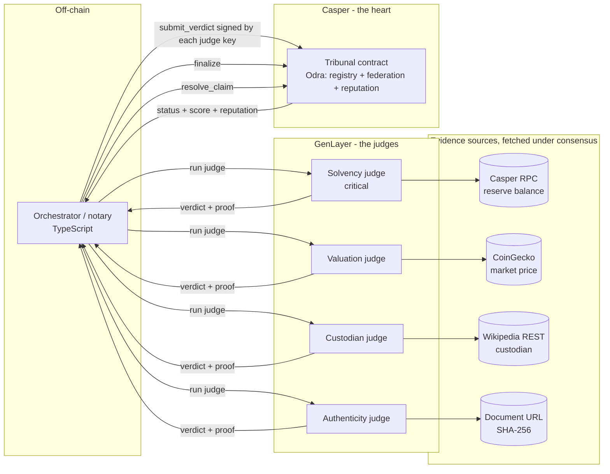
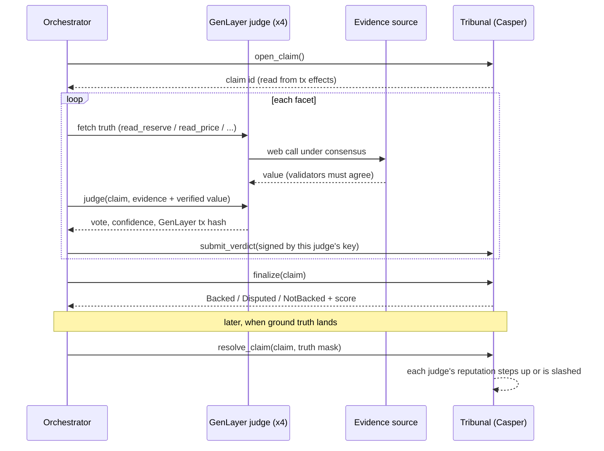
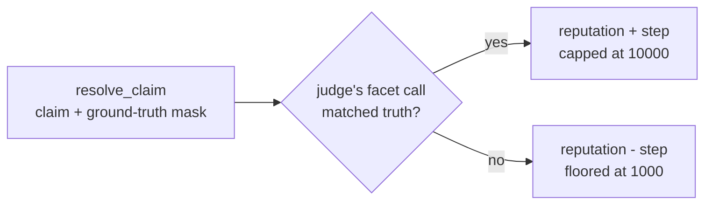
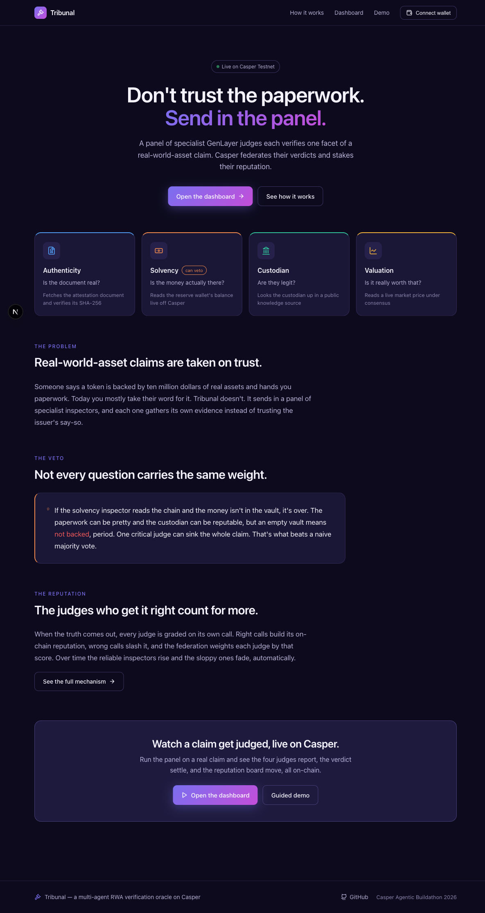
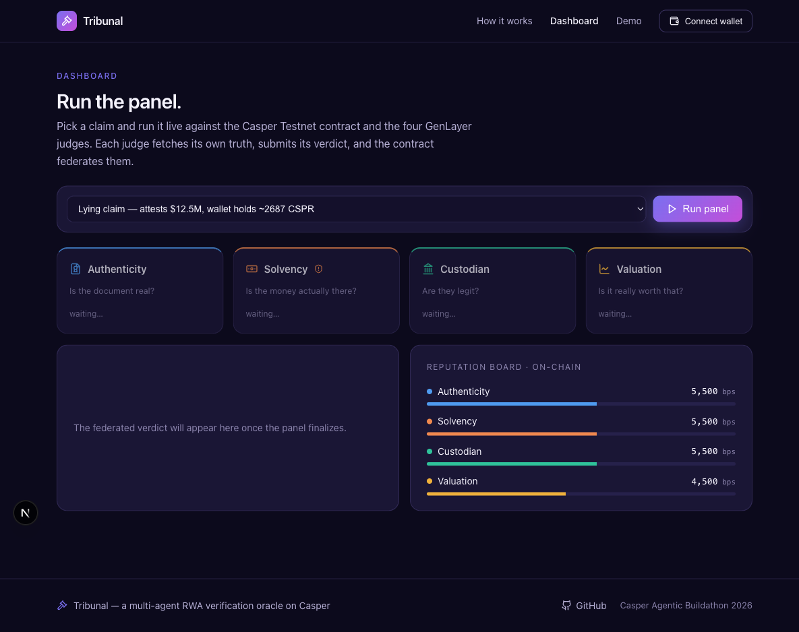

<div align="center">

# Tribunal

**A multi-agent RWA verification oracle with on-chain reputation, on Casper.**

A panel of specialist GenLayer judges each checks one facet of a real-world-asset claim, and a Casper (Odra) contract federates their verdicts into one auditable answer, weighting each judge by a reputation it earns and loses over time.


Built for the Casper Agentic Buildathon 2026.

</div>

---

## Contents

- [The idea, in plain English](#the-idea-in-plain-english)
- [What it does](#what-it-does)
- [Architecture](#architecture)
- [The claim lifecycle](#the-claim-lifecycle)
- [The panel](#the-panel)
- [The federation rule](#the-federation-rule)
- [Reputation, and how it moves](#reputation-and-how-it-moves)
- [What's deployed](#whats-deployed)
- [Runs on Testnet](#runs-on-testnet)
- [Run it yourself](#run-it-yourself)
- [Commands](#commands)
- [Configuration](#configuration)
- [Tech stack](#tech-stack)
- [Repository layout](#repository-layout)
- [Design principles](#design-principles)
- [On what's general vs the demo](#on-whats-general-vs-the-demo)
- [License](#license)

---

## The idea, in plain English

Imagine someone walks up and says "this token is backed by 10 million dollars of real assets, here's my paperwork." We don't just trust them. We send in a little panel of expert inspectors, and each inspector only cares about one thing.

- One inspector checks: is this paperwork even real and recent, or did you photoshop it?
- Another checks: the money you say is in the vault, is it actually in the vault?
- Another checks: the company you say is holding it, are they legit or are they shady?
- The last one checks: you say it's worth 10 million, but is that actually what it's worth on the market?

Each inspector is a GenLayer agent, and the reason GenLayer matters is that each inspector isn't one guy guessing, it's a whole room of validators agreeing on that one answer. So each inspection is solid.

Now they all report back, and here's the smart part: we don't just count votes, because the questions aren't equal. If the vault inspector comes back and says "the money isn't there," it's over. Doesn't matter that the paperwork was pretty and the company seemed nice. No money in the vault means not backed, period. That's the veto: some inspectors can sink the whole claim on their own.

But if nobody raises a dealbreaker, then we blend everyone's read into one overall answer, and we trust the inspectors who've been right before more than the ones who've been flaky. That's the reputation part: your track record decides how much your word counts.

Out the other end you get one clean answer the world can use: "yeah, backed, pretty confident" or "nope, not backed." And if anyone's curious why, they can peek and see exactly which inspector dragged it down.

Later, when the truth actually comes out, every inspector gets graded on whether they called it right. Good calls build their reputation, bad calls cost them. So over time the reliable inspectors rise and the sloppy ones fade, automatically.

That's the whole thing. A panel of sharp specialists, one of them can veto, the trusted ones count more, and they all live or die by their record. Casper is the building that keeps all the records and runs the scoring.

## What it does

Tribunal takes a real-world-asset claim (today: a proof-of-reserves claim, "this token is backed by these reserves") and fans it out to four specialist judges, each answering one narrow question and gathering its own evidence. It then settles all four into a single on-chain verdict, weighted by each judge's reputation, with one critical judge able to veto the whole thing. When ground truth later lands, the judges get graded and their reputations move.

The trust-critical parts live on Casper. The contract is the registry of judges, the store of every verdict, the federation logic, the canonical verdict, and the reputation ledger. The orchestrator off-chain is a notary: it makes no judgment of its own, it only commits what the judges provably attested.

What makes this more than a vote-counter:

- **Each judge fetches its own truth under GenLayer consensus**, not from the issuer's paperwork. The solvency judge reads the reserve wallet's balance live off Casper itself.
- **A critical facet can veto.** Three facets can pass and the claim still fails, because the one that matters said the money isn't there.
- **Reputation is per judge and lives on-chain.** Each judge signs with its own Casper key, so being right or wrong follows the individual judge, not the panel.

## Architecture

Three layers. Everything trust-critical is on Casper; only the orchestration (which judge to ask, when to finalize) is off-chain.



- **Casper contract (the heart).** An Odra 2.8 contract on Casper Testnet. Claim-agnostic by design: it only ever sees a claim id, a facet id, a vote, a confidence, and a GenLayer proof hash. The novel logic is two pure, fully unit-tested modules, `federation.rs` (veto + reputation-weighted aggregation) and `reputation.rs` (reward / slash). Everything is integer basis points (0 to 10000), no floats on-chain.
- **GenLayer judges (the truth-fetchers).** One `FacetJudge` intelligent contract, deployed once per facet. Each judge fetches its own evidence under GenLayer consensus and treats that verified figure as ground truth over the issuer's paperwork.
- **Orchestrator (the notary).** A TypeScript relay that triggers each judge's truth-fetch, runs the judge, reads the verdict, submits it to Casper signed by that judge's own key, then finalizes. It never decides anything itself.

## The claim lifecycle



## The panel

One generic `FacetJudge` contract is deployed four times, each a distinct specialist with its own rubric, its own GenLayer identity, and its own Casper key. Each fetches its own evidence and is matched to the right equivalence rule for its source.

| Facet | id | Critical | The one question it answers | Evidence it fetches | Equivalence rule |
|-------|----|----------|------------------------------|---------------------|------------------|
| Authenticity | 1 | no | Is the attestation document genuine and current? | The document at its URL, hashed | `strict_eq` on the SHA-256 |
| Solvency | 2 | **yes** | Do the reserves actually cover the liabilities? | The reserve wallet's balance, live off Casper RPC | `strict_eq`, exact motes |
| Custodian | 3 | no | Is the named custodian real and reputable? | A public knowledge-source lookup (Wikipedia REST) | agree on found + title |
| Valuation | 4 | no | Does the claimed value hold up at market? | A live USD price (CoinGecko), in micro-USD | custom validator, 5% tolerance band |

Solvency uses an exact match because an on-chain balance is deterministic. Valuation uses a tolerance band because prices drift between fetches. Custodian agrees on the stable facts (did it resolve, and to which article) rather than the full text. That's the point of GenLayer here: each judge's read is agreed by a room of validators, not one node.

## The federation rule

Each facet has a weight and a critical flag. On `finalize` the contract does two passes ([federation.rs](contract/src/federation.rs)):

1. **Veto pass.** Any critical facet that FAILs with reputation-weighted confidence at or above the veto threshold sinks the whole claim to NotBacked, regardless of the others. Authentic paperwork over an empty vault is still an unbacked token.
2. **Weighted pass.** If nothing vetoes, the verdicts combine into a reputation- and weight-weighted confidence score, mapped to a band: Backed, Disputed, or NotBacked. PASS adds confidence, FAIL subtracts it, and UNCERTAIN abstains entirely rather than dragging the score down, because "we don't know" is not the same as "it's false." If every judge abstains the result is Disputed, not a confident NotBacked.

Deployed thresholds (basis points): veto 4000, backed 7000, not-backed 4000, starting reputation 5000, reputation step 500, floor 1000.

## Reputation, and how it moves

When ground truth lands, `resolve_claim` scores each judge on its own facet call, not on the panel's headline. A correct call steps the judge's reputation up; a wrong one slashes it toward a floor ([reputation.rs](contract/src/reputation.rs)). Because each judge signs with its own Casper key, reputation accrues per judge.



This ran live on Testnet (claim 13). Four judges submitted, the claim finalized to NotBacked via the solvency veto, then `resolve_claim` was called against a ground truth where valuation had it wrong. Read straight off the resolve transaction's effects, the four reputations were **`[4500, 5500, 5500, 5500]`**: the three judges who called their facet correctly rose from 5000 to 5500, and the one that got it wrong was slashed to 4500. That's "trusted inspectors count more" actually settling on-chain.

## What's deployed

### Casper Testnet

Tribunal contract (the federation + reputation oracle):

- Package hash: `hash-d6c8b87c8e201265ec4f5f32dc0f01f36adb13a93a4a659ed29740c020afb5bd`
- Install tx: https://testnet.cspr.live/transaction/43fd9bcea5963093b447c0f137058ebc614644127b3c5f2c157b1c4b154b1f97

All four facets are configured and each judge is registered with its own Casper key. `open_claim`, `submit_verdict`, `finalize`, and `resolve_claim` all execute cleanly on Testnet (verified on the receipts, not just ACCEPTED).

### GenLayer judges

One deployed `FacetJudge` per facet, each code-verified on-chain:

| Facet | GenLayer address |
|-------|------------------|
| Authenticity | `0xbC694BEb00Afb616B03C1F9d33e1c5972dB92F7E` |
| Solvency | `0x95Ebac70f5a1dEc310586eF6292097A48bDe64b8` |
| Custodian | `0x89702F3113F2E9a2430a902ed2ab1Ac13970291B` |
| Valuation | `0xf56B39c091Ec6D112Cb3dF372aCcB83a1f8055C4` |

## Runs on Testnet

Every run is driven by the CLI, which opens the claim, reads the assigned id from `open_claim`'s own effects, runs the panel, and decodes the final status off-chain. No claim ids or outcomes are guessed.

| Claim | What it was | Outcome | Why |
|-------|-------------|---------|-----|
| 5 | CSPR-collateralized note, reserve genuinely covers it | **Backed** | solvency read 2671 CSPR live against a 2000 CSPR liability; three PASS verdicts averaged into the backed band |
| 8 | Reserves fall short | **NotBacked** | solvency read the reserve live, found it short, FAILed; the critical veto sank the claim |
| 10 | Real money, real custodian, wrong document | **Disputed** | every facet fetched its own truth; authenticity FAILed a hash-valid but wrong-kind-of-file document and pulled the aggregate into the disputed band |
| 13 | Resolution / reputation loop | reputations moved to `[4500,5500,5500,5500]` | verdicts hand-set to exercise resolution (not a GenLayer run); three correct judges rose, the wrong one was slashed |

The sharpest moment is the "lying" claim ([claim-lying.json](orchestrator/examples/claim-lying.json)): the paperwork attests $12.5M of backing, but the reserve wallet actually holds about 2687 CSPR on-chain. A judge that trusts the paperwork passes it; the solvency judge reads the chain and FAILs it, and the claim comes back NotBacked. Full details of every run are in [DEPLOYMENTS.md](DEPLOYMENTS.md).

## Frontend

A Next.js app in [`ui/`](ui/) presents the product and runs the panel live against the deployed contract and judges. Four pages: a landing page, a "how it works" explainer, a dashboard that runs a claim and streams each judge's verdict in as it lands, and a guided demo. The reputation board reads each judge's reputation live off the contract, and the run streams real Casper and GenLayer tx links.





The reputation board above is reading the real on-chain values from claim 13's resolution (5500 / 5500 / 5500 / 4500). See [docs/screenshots](docs/screenshots) for the how-it-works and demo pages too.

To run it (needs the CSPR.cloud bridge from the Orchestrator section running in another terminal, and a `ui/.env` with the same values as `orchestrator/.env`):

```bash
cd ui
npm install
npm run dev      # http://localhost:3000
```

A live full-panel run drives GenLayer's studionet, which can be slow and occasionally throws transient RPC errors; the relay retries, and the dashboard streams progress so it stays responsive. The reputation board and the on-chain reads work instantly regardless.

## Run it yourself

### Contract

```bash
cd contract
cargo odra test            # 13 tests: federation, reputation, full lifecycle, veto, resolution
cargo odra build -b casper # builds the wasm
```

### Orchestrator

The orchestrator needs a `.env` (see [orchestrator/.env.example](orchestrator/.env.example)): a funded Casper Testnet key, the deployed Tribunal package hash, a CSPR.cloud key, a GenLayer deployer key, and the four GenLayer judge addresses.

CSPR.cloud's hosted node has no SSE event stream, which the Odra deployer needs, so a small local bridge supplies one and injects the auth header. Run it in one terminal:

```bash
cd orchestrator
npm install
CSPR_CLOUD_KEY=... npx tsx src/proxy.ts
```

Then run a full claim end to end in another:

```bash
npx tsx src/cli.ts claim ./examples/claim-lying.json
```

This opens a claim on Casper, runs all four judges (each fetching its own truth under GenLayer consensus), submits four verdicts signed by four separate judge keys, finalizes, and prints the final on-chain status with the per-facet breakdown.

## Commands

| Command | What it does |
|---------|--------------|
| `cli.ts claim <evidence.json>` | open a claim, run the full panel, read the final status, all from chain |
| `cli.ts open` | open a new claim (note the sequential id) |
| `cli.ts relay <claimId> <evidence.json>` | run the full panel on an existing claim and finalize |
| `cli.ts relay-facet <facet> <claimId> <evidence.json>` | run one facet (authenticity \| solvency \| custodian \| valuation) |
| `cli.ts resolve <claimId> <truthMask>` | score each judge against ground truth and move reputation (mask sets a bit per truly-passing facet id) |
| `scripts/setup-judge-keys.mjs` | generate, fund, and register the four per-judge Casper keys (idempotent) |
| `scripts/demo-resolution.mjs` | run the full resolution / reputation loop live on Testnet |
| `scripts/genlayer-keygen.mjs` | generate the GenLayer deployer key |
| `src/proxy.ts` | local CSPR.cloud bridge (auth header + synthetic SSE stream) |

## Configuration

All secrets and endpoints come from the environment, never inlined. See [orchestrator/.env.example](orchestrator/.env.example).

| Variable | Used by | Notes |
|----------|---------|-------|
| `CASPER_NODE_URL` | orchestrator | the node the relay submits through (points at the local proxy, e.g. `http://127.0.0.1:7777/rpc`) |
| `CASPER_NETWORK` | orchestrator | `casper-test` |
| `CASPER_SECRET_KEY` | orchestrator | admin / deployer key path (signs open, finalize, resolve) |
| `CASPER_PUBLIC_NODE_URL` | solvency judge | a public no-auth Casper node the GenLayer validators can reach to read the reserve balance |
| `TRIBUNAL_CONTRACT_HASH` | orchestrator | deployed package hash |
| `CSPR_CLOUD_KEY` | proxy | CSPR.cloud API key the bridge injects |
| `GENLAYER_NETWORK` | orchestrator | `localnet` \| `studionet` \| `testnet-asimov` \| `testnet-bradbury` |
| `GENLAYER_DEPLOYER_KEY` | orchestrator | GenLayer account that drives the judges |
| `GENLAYER_{AUTHENTICITY,SOLVENCY,CUSTODIAN,VALUATION}_JUDGE` | orchestrator | the four deployed judge addresses |
| `PROXY_PORT`, `CASPER_UPSTREAM` | proxy | bridge listen port and upstream node |

## Tech stack

| Layer | Choice | Why |
|-------|--------|-----|
| On-chain contract | Odra 2.8.0 (Rust to WASM) | the federation + reputation logic, where trust has to live; pure modules stay unit-testable |
| Chain | Casper Testnet | the registry, settlement, and economics of the oracle |
| Judges | GenLayer intelligent contracts (Python, `py-genlayer`) | each judgement is agreed by a room of validators, not one node; can read the open web under consensus |
| Runner | pinned `py-genlayer:1jb45aa8...z09h6` | concrete runner version hash, never `latest`/`test` |
| Orchestrator | TypeScript, `tsx` | the off-chain notary glue |
| Casper SDK | `casper-js-sdk` ^5.0.12 | build, sign, and send the Casper transactions natively |
| GenLayer SDK | `genlayer-js` ^1.1.8 | drive the judges, read verdicts |
| Toolchain | Rust `nightly-2026-01-01`, Node | as pinned in `rust-toolchain` |
| Evidence sources | Casper RPC, CoinGecko, Wikipedia REST, document URL | real, fetchable data per facet |

## Repository layout

```
contract/                  Odra Rust contract: the heart
  src/federation.rs        pure two-pass veto + reputation-weighted aggregation
  src/reputation.rs        pure reputation update (reward / slash)
  src/tribunal.rs          storage + entry points + HostEnv tests
  src/types.rs             Vote, ClaimStatus, FacetConfig, SubmittedVerdict
judges/
  facet_judge.py           one generic FacetJudge: fetches truth under consensus, then rules
  rubrics.py               the four facet rubrics (one per deployed judge)
orchestrator/
  src/orchestrate.ts       run the panel, submit each verdict, finalize once
  src/casper.ts            build / sign / send the Casper transactions
  src/genlayer.ts          drive the judges, with retry + read-after-write polling
  src/chainread.ts         recover the claim id and decode status from tx effects
  src/proxy.ts             local CSPR.cloud bridge (auth header + synthetic SSE)
  src/cli.ts               run a claim, a facet, or a resolution from the terminal
  scripts/                 key setup + the live resolution demo
  examples/                backed / unbacked / lying example claims
ui/                        Next.js frontend
  app/                     landing, how-it-works, dashboard, demo + API routes
  components/              JudgePanel, VerdictCard, ReputationBoard, etc.
  lib/                     facet metadata, theme tokens, SSE client, types
docs/                      the design spec, implementation plan, screenshots
DEPLOYMENTS.md             every on-chain run, with tx hashes
```

## Design principles

1. **The contract is the source of truth.** Status, score, and reputation are read back from chain or decoded from tx effects, never guessed. The orchestrator recovers the claim id from `open_claim`'s own effects and the final status by diffing effects.
2. **The relay judges nothing.** It only commits what a judge provably attested, carrying the GenLayer tx hash as proof. GenLayer is the judge; Casper is the registry and the economics.
3. **Each judge gathers its own truth.** Verdicts are decided against the chain, a price feed, or a public record, not against the issuer's paperwork. Where a verified value exists, it overrides whatever the paperwork claims.
4. **Reputation is per judge.** Every judge signs with its own Casper key, so being right or wrong follows the individual, which is what makes the weighting mean anything.
5. **Integer-only on-chain.** Confidence and reputation are basis points everywhere, no floats in the contract.
6. **ACCEPTED is not executed.** On GenLayer a deploy can reach ACCEPTED with validators agreeing and still have failed execution. Deploys are only trusted after the receipt's execution result is read and `genlayer code <addr>` resolves.

## On what's general vs the demo

The reputation and federation engine on Casper is fully claim-agnostic. What's wired up today is the proof-of-reserves panel, and its solvency facet reads native CSPR off a Casper node because the demo's reserve is a CSPR-collateralized note. Pointing it at a different asset or chain (a CEP-18 token, or USDC on an EVM chain via GenLayer's cross-chain `eth_call` reads) is a change to that one fetch function, with the contract and the reputation layer untouched. The contract never learns what the asset was; it only ever sees facets, votes, and confidences.

## License

All code and content is original, built for the Casper Agentic Buildathon 2026. Released under the MIT License, see [LICENSE](LICENSE).
